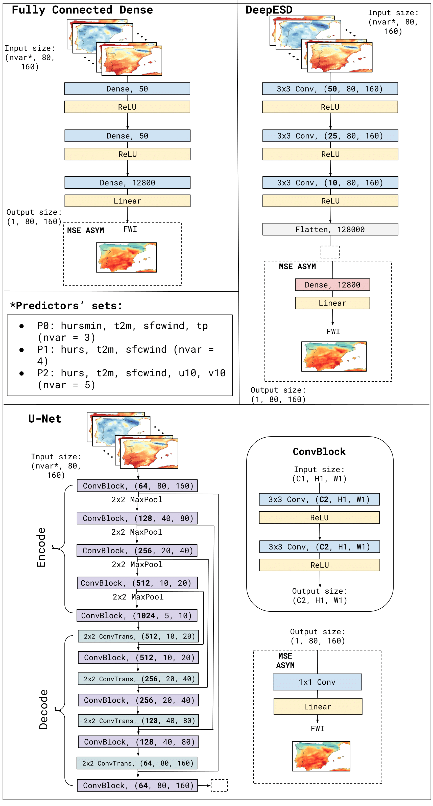

# DeepFWI
This repository contains a Jupyter Notebook (`main.ipynb`), where the Fire Weather Index (FWI) is emulated using deep learning techniques with basic climate variables as input features. The `config_nb.yaml` file provides the deep learning optimization parameters, which can be adjusted by the user as desired.



## Environment Installation

The required packages and dependencies to run the experiments are listed in `environment.yaml`. To set up the environment, follow these steps:

1. **Create the environment using Mamba for faster dependency resolution:**
   ```bash
   conda create -n deep-fwi -c conda-forge mamba
2. **Activate environment**
   ```bash
   conda activate deep-fwi
3. **Use Mamba to install the packages required**
   ```bash
   mamba env create -f environment.yaml
  
Once the environment is installed and activated, open the Jupyter notebook and enjoy emulating! :)


The data required to run the code is available on Zenodo: 

- Mirones, Ó., Bedia Jiménez, J., & Baño-Medina, J. (2025). Toy Dataset for Emulating the Fire Weather Index (FWI) Using Deep Learning Techniques [Data set]. Zenodo. https://doi.org/10.5281/zenodo.15075367

Instructions for downloading it can be found within the notebook.
